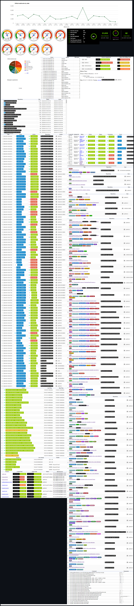

# Projects Monitor

⚙️ 🔔 A centralized dashboard to monitor and manage the health and status of GitHub repositories, personal projects, and infrastructure.

[](https://wakatime.com/badge/github/guibranco/projects-monitor)
[](https://github.com/guibranco/Projects-Monitor/actions/workflows/deploy.yml)
[](https://codeclimate.com/github/guibranco/projects-monitor/maintainability)
[](https://codeclimate.com/github/guibranco/projects-monitor/test_coverage)
[](https://www.codefactor.io/repository/github/guibranco/projects-monitor)

---

## Overview

Projects Monitor is a single-page dashboard powered by a REST-like API in PHP. It is designed to provide a "flight control panel" for managing and visualizing the status of various projects, services, and infrastructure in one place. 
You can find a preview of the current dashboard at the bottom of this README.md file.

### Features

- **GitHub Integration**:
  - View pending and open pull requests.
  - Monitor issues across repositories.
  - Track webhook activity.
  - Highlight workflow runs, emphasizing failures.
  - Monitor API usage and track the latest releases of specific projects.

- **Infrastructure Health**:
  - View domain lifecycle, DNS, and registrar information, including expiration dates and transfer statuses.
  - Monitor health checks from various services such as HealthChecks.io, UpTimeRobot, AppVeyor CI, GitHub Actions, etc.
  - Retrieve CloudAMQP stats, including queues, messages, consumers, and connections.

- **Logs and Errors**:
  - Aggregate error logs from the filesystem and SQL tables.
  - Analyze logs with detailed statistics and grouping options, such as by application or error content.

- **Continuous Integration**:
  - Display AppVeyor CI build statuses.

- **WireGuard VPN**:
  - List the status of the WireGuard VPN clients and connections.

### Upcoming Improvements

> [!Warning]
> A UI kit is planned to enhance the visual and functional aspects of the dashboard. Follow the progress in [#12](https://github.com/guibranco/projects-monitor/issues/12).

---

## Requirements

- PHP 8.0 or later.
- A web server (e.g., Apache, Nginx).
- MySQL or another supported database.
- Composer for dependency management.

---

## Authentication

Access to the live dashboard requires login credentials. This ensures the privacy of sensitive information and restricts unauthorized access.

---

## Installation

1. Clone the repository:
   ```bash
   git clone https://github.com/guibranco/projects-monitor.git
   cd projects-monitor
   ```

2. Install dependencies:
   ```bash
   composer install
   ```

3. Configure the `.secrets.php` files:
   - Provide your GitHub API token for repository data fetching.
   - Add credentials for UpTimeRobot, AppVeyor, and other integrated services.
   - Set database credentials for storing logs and configurations.

4. Start the application on your local server or deploy it to a hosting environment.

---

## API Endpoints

The Projects Monitor includes a REST-like API to retrieve data from integrated services. Below is the list of available endpoints:

- `/api/v1/appveyor`  
  Retrieve the data from AppVeyor CI.

- `/api/v1/cpanel`  
  Retrieve cPanel stats, including error logs and usage statistics.

- `/api/v1/domains`  
  Retrieve DNS and registrar information about domains, such as lifetime, expiration dates, and transfer status.

- `/api/v1/github`  
  Retrieve GitHub data like issues, pull requests, account usage, API usage, and the latest releases of specific projects.

- `/api/v1/healthchecksio`  
  Retrieve the status of health checks from HealthChecks.io.

- `/api/v1/log-message`  
  Save a structured log message to an SQL table.

- `/api/v1/message`  
  Retrieve a single message from the SQL table.

- `/api/v1/messages`  
  Retrieve a list of messages and related statistics, such as total error messages and groupings by application or error content.

- `/api/v1/postman`  
  Retrieve usage statistics from the Postman API.

- `/api/v1/queues`  
  Retrieve CloudAMQP stats, including queue details, message counts, consumers, and connections.

- `/api/v1/uptimerobot`  
  Retrieve the status of monitored services from UpTimeRobot.com.

- `/api/v1/webhooks`  
  Retrieve stats and data from the WebHooks project, focusing on GitHub webhook handlers.

- `/api/v1/wireguard`  
  Retrieve the status of the WireGuard VPN client and connection.

---

## Preview



---

## Contributing

Contributions are welcome! Feel free to fork this repository, submit a pull request, or create an issue for suggestions and improvements.

---

## License

This project is licensed under the [MIT License](LICENSE).

