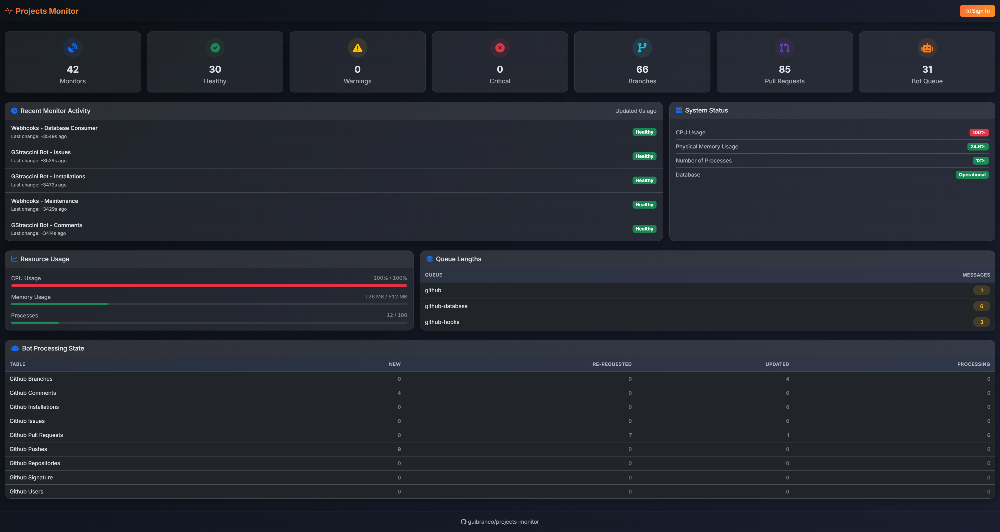
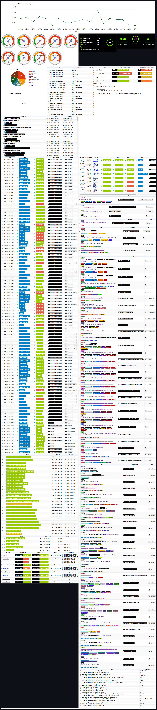

# Projects Monitor

⚙️ 🔔 A single-page "flight control panel" for GitHub repositories, personal projects, and the infrastructure behind them — pull requests, issues, webhooks, health checks, DNS, queues, and error logs, all in one authenticated dashboard.

[](https://wakatime.com/badge/github/guibranco/projects-monitor)
[](https://github.com/guibranco/Projects-Monitor/actions/workflows/build.yml)
[](https://github.com/guibranco/Projects-Monitor/actions/workflows/deploy.yml)
[](https://sonarcloud.io/summary/new_code?id=guibranco_projects-monitor)
[](https://codeclimate.com/github/guibranco/projects-monitor/maintainability)
[](https://codeclimate.com/github/guibranco/projects-monitor/test_coverage)
[](https://www.codefactor.io/repository/github/guibranco/projects-monitor)

---

## Overview

Projects Monitor is a PHP dashboard backed by a REST-like API (`Src/api/v1`). It logs in over a session-based auth flow, then renders live tiles and gauges for every service the author's projects depend on — GitHub, cPanel, RabbitMQ, WireGuard, Vercel, and more — so an outage or a stuck queue is visible at a glance instead of buried in a dozen separate dashboards. A preview of the login and dashboard screens is at the bottom of this README.

### Features

- **GitHub integration** — open/pending pull requests, issues across repositories, workflow runs (failures highlighted), API rate-limit usage, and the latest releases of tracked projects.
- **Webhooks & automation** — GitHub webhook statistics and processing-state counts, plus a right-hand **Actions** panel (offcanvas, top-right of the dashboard) listing live webhook workers and GStraccini Bot job runs.
- **Infrastructure health** — HealthChecks.io, UpTimeRobot, AppVeyor CI, and Vercel deployment status; CloudAMQP/RabbitMQ queue, message, consumer, and connection stats; WireGuard VPN client/connection status over SSH; a remote server health report (load average, CPU/memory/swap/disk usage, pending-reboot flag, and key systemd service states) collected by running a `monitor-report` script on the host over the same SSH connection.
- **Domains** — registrar and lifecycle information (expiration, transfer status) via IP2WHOIS, plus a dedicated [DNS Records page](Src/dns.php) listing every zone record (A, CNAME, MX, TXT, ...) pulled live from cPanel, filterable by source domain/record type and sortable by any column.
- **Logs & errors** — cPanel error logs and SQL-backed application errors, aggregated with grouping and statistics by application or error content.
- **Public stats** — a pre-computed, unauthenticated stats page fed by a cron worker (see [Background workers](#background-workers)).
- **Interactive API docs** — a Swagger UI served at `/api/v1/swagger`, backed by the OpenAPI spec at `/api/v1/openapi` (both behind login).

---

## Tech stack

- **PHP 8.2+** (the Docker image tracks `php:8.6-rc-apache`), Apache, Composer.
- **MariaDB/MySQL** for errors, messages, and user accounts.
- **[guibranco/pancake](https://github.com/guibranco/pancake)** for HTTP requests and shared helpers, `phpseclib/phpseclib` for SSH/WireGuard checks, `fastvolt/markdown` for rendering release notes.
- **Docker Compose** for local development: an Apache/PHP app container, a MariaDB container, and [Mailpit](https://github.com/axllent/mailpit) standing in for a real mailserver.
- **PHPUnit** for unit tests; shell scripts under `Tests/` and `Tools/` for smoke tests, DB integrity checks, and migrations.

---

## Requirements

- PHP 8.2 or later, with the `mbstring`, `mysqli`, `sockets`, `shmop`, and `zip` extensions.
- Composer.
- MariaDB or MySQL.
- Docker and Docker Compose (recommended for local development — see below).

---

## Local development

The repo ships a `docker-compose.yml` with everything needed to run the app locally:

```bash
git clone https://github.com/guibranco/projects-monitor.git
cd projects-monitor
docker compose up -d
```

This starts three containers:

| Service    | Purpose                              | Local address           |
| ---------- | ------------------------------------- | ------------------------ |
| `www`      | Apache + PHP 8.6-rc app               | http://localhost:8000    |
| `database` | MariaDB (`test`/`test`)               | localhost:3306            |
| `mailpit`  | Catches outbound mail from `mail()`   | http://localhost:8025 (UI), `1025` (SMTP) |

Apply the SQL migrations in `Sql/` (in order) to the `test` database — `Tools/db-migration.sh` does this in CI and can be run the same way locally.

### Secrets

Each integration lazily loads its own file from `Src/secrets/`, so you only need to create the ones for the integrations you're working with — everything else fails closed with a `SecretsFileNotFoundException` instead of breaking the rest of the dashboard. At minimum, local development needs `mySql.secrets.php`:

```php
<?php
$mySqlHost     = "database";
$mySqlUser     = "test";
$mySqlPassword = "test";
$mySqlDatabase = "test";
```

The full set of integrations and their secrets files:

| Integration                | Secrets file                        |
| --------------------------- | ------------------------------------ |
| MySQL/MariaDB               | `mySql.secrets.php`                  |
| GitHub                      | `gitHub.secrets.php`                 |
| AppVeyor CI                 | `appVeyor.secrets.php`               |
| cPanel                      | `cPanel.secrets.php`                 |
| HealthChecks.io             | `healthChecksIo.secrets.php`         |
| UptimeRobot                 | `upTimeRobot.secrets.php`            |
| Vercel                      | `vercel.secrets.php`                 |
| RabbitMQ / CloudAMQP        | `rabbitMq.secrets.php`               |
| SSH (also used for WireGuard status and the server health report) | `ssh.secrets.php` |
| IP2WHOIS (domain lookups)   | `Ip2WhoIsSecrets.php`                |
| Postman                     | `postman.secrets.php`                |
| Webhooks project            | `webhooks.secrets.php`               |
| GStraccini Bot              | `gstracciniBot.secrets.php`          |
| LogStream                   | `logStream.secrets.php`              |

### GitHub Actions billing

`Src/Library/github-billing.json` (validated against `github-billing.schema.json`) is the source of truth for which GitHub accounts are polled for Actions included-usage (minutes/storage) and how each account's quota is resolved — see [GitHubBillingConfig.php](Src/Library/GitHubBillingConfig.php). Each account is an independent billing pool: minutes, storage, and reset dates are never summed across accounts, only compared for a "highest utilisation" warning.

- **To change a plan** (e.g. an org upgrades from `free` to `team`), edit that account's `planType` in the JSON — no code change needed. `overrides` (per-account `minutes`/`storageMb`) win over the plan default; use them when GitHub's billing page shows a different allowance than the published plan table (see the `_source` link in the JSON).
- **Validation is eager and loud**: an unknown `planType`, or an `accountType` the plan doesn't allow (e.g. an org marked `pro`), throws `GitHubBillingConfigException` naming the offending account rather than silently producing a wrong percentage.
- **Token scopes**: the shared `gitHubToken` from `gitHub.secrets.php` needs to cover Actions billing reads for every configured account — a classic PAT needs `admin:org` (for the org endpoints) plus user/plan read for the personal account; a fine-grained PAT needs "Plan" (user, read) and "Administration" (org, read). If one token can't cover every account, set that account's `tokenSecret` in the JSON to the name of another global variable defined in `gitHub.secrets.php` (the JSON only ever holds a variable *name*, never a token value).
- **Where the numbers come from**: allowances come from the JSON, not the API — GitHub's usage endpoints don't return the included quota. `GitHubActionsUsage` also infers an allowance from `discountAmount`/`pricePerUnit` per SKU and logs a warning (category `github-billing`) when it diverges from the configured value by more than 5%, as an early signal that a plan changed and the JSON is stale.

### Tests

```bash
composer install --working-dir=Src
vendor/bin/phpunit -c Tests/phpunit.xml   # unit tests
bash Tests/smoke-tests.sh                  # hits the running app's key endpoints
bash Tests/db-integrity.sh                 # checks the applied schema
```

### Background workers

Two CLI workers are meant to run on a cron schedule against the deployed instance (see the docblock in each file for the exact crontab line):

- `Src/Worker/GeneratePublicStats.php` — pre-computes the public stats page every 5 minutes.
- `Src/Worker/ProcessErrorLogs.php` — polls cPanel for `error_log` files, persists them to the `errors` table, and cleans them up.

---

## Authentication

Access to the dashboard requires login credentials, stored in the `users` table. A password-recovery flow is available at `reset.php`.

---

## API

The dashboard is backed by a REST-like API under `/api/v1`, documented with a live Swagger UI:

- **Swagger UI:** `/api/v1/swagger`
- **OpenAPI spec:** `/api/v1/openapi`

Both require an authenticated session. Key endpoint groups: `github`, `webhooks*` (statistics, per-entity processing, worker control), `gstraccini-jobs` / `gstraccini-job-run`, `appveyor`, `cpanel`, `dns-records`, `domains`, `healthchecksio`, `uptimerobot`, `vercel`, `queues` / `queues-purge`, `wireguard`, `system-report`, `messages*` / `errors*` (log retrieval, details, deletion), and `public-stats`.

---

## Deployment

`deploy.yml` builds a versioned release (via [GitVersion](https://gitversion.net/), GitHubFlow), writes each integration's secrets file from GitHub Actions secrets, zips `Src/` into `deploy.zip`, and ships it over FTP. `install.php` unpacks the zip on the target server and removes itself. The workflow runs on every push to `main`.

---

## Preview

### Login

The login page, with basic (public) information:


### Dashboard

The authenticated dashboard, with full (restricted) information:


---

## Contributing

Contributions are welcome! Feel free to fork this repository, submit a pull request, or open an issue to suggest or request improvements.

---

## License

MIT — see `composer.json`.
